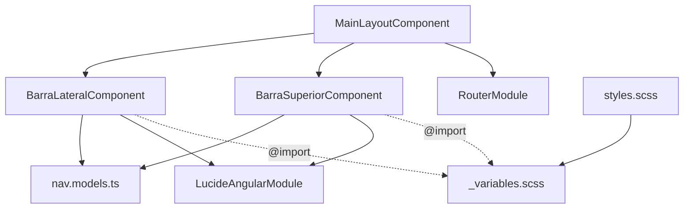

# 📦 inventario-ui — Documentación Técnica

> Librería Angular de componentes UI compartidos para el sistema de inventario SENA.
> Repositorio: `Brian7st/lib-gas-layout-frontend`

---

## 1. Resumen Ejecutivo

| Campo | Valor |
|---|---|
| **Nombre** | `inventario-ui` |
| **Tipo** | Angular Library (ng-packagr) |
| **Versión** | `1.0.0` |
| **Angular** | `^20.0.0` |
| **TypeScript** | `~5.9.0` |
| **Selector prefix** | `app-` |
| **Compilación** | Partial (Ivy) |
| **Salida** | `dist/inventario-ui/` |

### Propósito

Proveer la **estructura visual base** (shell) idéntica para todos los micro-frontends del sistema de inventario SENA. Garantiza consistencia visual, tipográfica y de navegación entre módulos independientes.

---

## 2. Stack Tecnológico

### Dependencies (runtime)

| Paquete | Versión |
|---|---|
| `@angular/animations` | `^20.0.0` |
| `@angular/common` | `^20.0.0` |
| `@angular/compiler` | `^20.0.0` |
| `@angular/core` | `^20.0.0` |
| `@angular/forms` | `^20.0.0` |
| `@angular/platform-browser` | `^20.0.0` |
| `@angular/platform-browser-dynamic` | `^20.0.0` |
| `@angular/router` | `^20.0.0` |
| `lucide-angular` | `^1.0.0` |
| `rxjs` | `~7.8.0` |
| `tslib` | `^2.3.0` |
| `zone.js` | `~0.15.0` |

### DevDependencies (build)

| Paquete | Versión |
|---|---|
| `@angular-devkit/build-angular` | `^20.0.0` |
| `@angular/cli` | `^20.0.0` |
| `@angular/compiler-cli` | `^20.0.0` |
| `ng-packagr` | `^20.0.0` |
| `typescript` | `~5.9.0` |

### Peer Dependencies (exigidos al consumidor)

| Paquete | Versión |
|---|---|
| `@angular/common` | `^20.0.0` |
| `@angular/core` | `^20.0.0` |
| `@angular/router` | `^20.0.0` |
| `lucide-angular` | `^1.0.0` |

---

## 3. Arquitectura del Workspace

```
inventario-ui-workspace/          ← Angular workspace (no es una app)
├── angular.json                  ← Config del proyecto tipo "library"
├── package.json                  ← Deps del workspace
├── tsconfig.json                 ← TSConfig base
├── INSTRUCCIONES.md              ← Guía de uso
└── projects/
    └── inventario-ui/            ← LA LIBRERÍA
        ├── package.json          ← Peer dependencies
        ├── ng-package.json       ← Config ng-packagr
        ├── tsconfig.lib.json     ← TSConfig library (partial compilation)
        ├── tsconfig.lib.prod.json
        └── src/
            ├── public-api.ts     ← Barrel de exports
            ├── lib/              ← Componentes
            │   ├── models/
            │   │   └── nav.models.ts
            │   ├── barra-lateral/
            │   │   ├── barra-lateral.component.ts
            │   │   ├── barra-lateral.component.html
            │   │   └── barra-lateral.component.scss
            │   ├── barra-superior/
            │   │   ├── barra-superior.component.ts
            │   │   ├── barra-superior.component.html
            │   │   └── barra-superior.component.scss
            │   └── main-layout/
            │       ├── main-layout.component.ts
            │       ├── main-layout.component.html
            │       └── main-layout.component.scss
            └── styles/
                ├── _variables.scss    ← Design tokens
                └── styles.scss        ← Reset + layout + utilidades
```

---

## 4. Public API

```typescript
// public-api.ts — Todo lo que se exporta al consumidor
export * from './lib/models/nav.models';
export * from './lib/barra-lateral/barra-lateral.component';
export * from './lib/barra-superior/barra-superior.component';
export * from './lib/main-layout/main-layout.component';
```

> [!IMPORTANT]
> Los estilos (`styles.scss` y `_variables.scss`) se distribuyen como assets SCSS, NO como exports TypeScript. El consumidor los importa en su `angular.json` o `styles.scss`.

---

## 5. Interfaces (Modelos)

Archivo: `lib/models/nav.models.ts`

### `NavItem`

```typescript
export interface NavItem {
  label: string;           // Texto del enlace
  ruta: string;            // Path de la ruta Angular
  icono: string;           // Nombre del ícono Lucide (e.g. 'layout-dashboard')
  insignia?: number;       // Número en el badge (opcional)
  insigniaAlerta?: boolean; // Badge en rojo si true (opcional)
}
```

### `NavGrupo`

```typescript
export interface NavGrupo {
  etiqueta: string;  // Título del grupo (e.g. 'Panel Principal')
  items: NavItem[];  // Items de navegación del grupo
}
```

### `PerfilConfig`

```typescript
export interface PerfilConfig {
  nombre?: string;     // Nombre del usuario
  avatarUrl?: string;  // URL de la imagen de perfil
}
```

### `BarraLateralConfig`

```typescript
export interface BarraLateralConfig {
  titulo: string;       // Título principal (e.g. 'INVENTARIO')
  subtitulo?: string;   // Subtítulo (e.g. 'FICHA 0000000')
  logoUrl?: string;     // URL del logo — si vacío muestra ícono genérico
  grupos: NavGrupo[];   // Grupos de navegación
}
```

### `TopNavLink`

```typescript
export interface TopNavLink {
  label: string;  // Texto del enlace
  ruta: string;   // Path de la ruta
}
```

---

## 6. Componentes

### 6.1 `MainLayoutComponent` (Shell)

| Propiedad | Valor |
|---|---|
| **Selector** | `app-main-layout` |
| **Standalone** | `true` |
| **Imports** | `CommonModule`, `RouterModule`, `BarraLateralComponent`, `BarraSuperiorComponent` |

#### Inputs

| Input | Tipo | Default | Descripción |
|---|---|---|---|
| `sidebarConfig` | `BarraLateralConfig` | `{ titulo: 'Mi App', grupos: [] }` | Configuración completa del sidebar |
| `perfil` | `PerfilConfig` | `{}` | Datos del usuario logueado |
| `buscarPlaceholder` | `string` | `'Buscar...'` | Placeholder del buscador |
| `topMenu` | `TopNavLink[]` | `[]` | Enlaces de navegación superior |

#### Template

```html
<div class="layout-principal">
  <app-barra-lateral [config]="sidebarConfig"></app-barra-lateral>

  <main class="contenido-principal">
    <app-barra-superior
      [perfil]="perfil"
      [buscarPlaceholder]="buscarPlaceholder"
      [enlaces]="topMenu"
    ></app-barra-superior>

    <div class="contenido-principal__contenedor">
      <router-outlet></router-outlet>
    </div>
  </main>
</div>
```

#### Arquitectura visual

```
┌─────────────────────────────────────────────────────┐
│ ┌──────────┐ ┌────────────────────────────────────┐ │
│ │          │ │  BarraSuperiorComponent (64px)     │ │
│ │  Barra   │ ├────────────────────────────────────┤ │
│ │ Lateral  │ │                                    │ │
│ │ (256px)  │ │       <router-outlet>              │ │
│ │          │ │       Contenido dinámico            │ │
│ │          │ │                                    │ │
│ └──────────┘ └────────────────────────────────────┘ │
└─────────────────────────────────────────────────────┘
```

> [!NOTE]
> Los estilos de `.layout-principal` y `.contenido-principal` están en `styles/styles.scss` (globales), NO en el componente. El archivo `main-layout.component.scss` está vacío intencionalmente con comentarios explicativos.

---

### 6.2 `BarraLateralComponent`

| Propiedad | Valor |
|---|---|
| **Selector** | `app-barra-lateral` |
| **Standalone** | `true` |
| **Imports** | `CommonModule`, `RouterModule`, `LucideAngularModule` |
| **BEM Block** | `.barra-lateral` |

#### Input

| Input | Tipo | Default |
|---|---|---|
| `config` | `BarraLateralConfig` | `{ titulo: 'Mi App', subtitulo: '', logoUrl: '', grupos: [] }` |

#### Estructura del template

1. **Encabezado** — Logo (imagen o ícono Lucide genérico) + título + subtítulo
2. **Navegación** — `@for` sobre `config.grupos`, cada grupo con etiqueta y `@for` sobre items
3. **Footer fijo** — Configuración, Perfil, Cerrar Sesión (hardcoded)

#### Características del template

- Usa `@if` / `@for` (nueva sintaxis Angular, NO `*ngIf`/`*ngFor`)
- `routerLinkActive` para estado activo con clase `barra-lateral__enlace--activo`
- Badges opcionales con variante `--alerta` (rojo)
- Tracking: `track grupo.etiqueta` y `track item.ruta`

#### SCSS — BEM Elements

| Clase BEM | Función |
|---|---|
| `__encabezado` | Contenedor del logo y título |
| `__logo-contenedor` | Flex row: ícono + texto |
| `__logo-icono` | Cuadrado 2.5rem con fondo verde SENA |
| `__logo-icono--imagen` | Variante: fondo blanco con borde |
| `__logo-img` | Imagen 90% contain |
| `__logo-simbolo` | Ícono Lucide blanco (fallback) |
| `__titulo` | Font 1.05rem, weight 900, color verde SENA |
| `__subtitulo` | Font 0.6rem, uppercase, letter-spacing |
| `__navegacion` | Flex column, overflow-y auto, scrollbar custom |
| `__grupo` | Contenedor de grupo |
| `__etiqueta-grupo` | Label uppercase 0.625rem |
| `__grupo-items` | Stack de links |
| `__enlace` | Link: flex, gap, padding, border-radius, transition |
| `__enlace--activo` | Border-left 4px verde, fondo verde claro |
| `__enlace--con-insignia` | Justify space-between |
| `__enlace--peligro` | Color rojo (cerrar sesión) |
| `__icono` | 1.25rem, flex-shrink 0 |
| `__texto` | 0.875rem, weight 500 |
| `__insignia` | Badge: font 0.625rem, border-radius full |
| `__insignia--alerta` | Background rojo, texto blanco |
| `__pie` | Footer: border-top, padding, flex column |

---

### 6.3 `BarraSuperiorComponent`

| Propiedad | Valor |
|---|---|
| **Selector** | `app-barra-superior` |
| **Standalone** | `true` |
| **Imports** | `CommonModule`, `RouterModule`, `LucideAngularModule` |
| **BEM Block** | `.barra-superior` |

#### Inputs

| Input | Tipo | Default |
|---|---|---|
| `perfil` | `PerfilConfig` | `{}` |
| `buscarPlaceholder` | `string` | `'Buscar...'` |
| `enlaces` | `TopNavLink[]` | `[]` |

#### Estructura del template

1. **Nav links** — `@for` sobre `enlaces` con `routerLinkActive` (condicional: solo si hay enlaces)
2. **Buscador** — Input con ícono Lucide `search`, placeholder configurable
3. **Acciones** — Botón notificaciones (bell) + avatar/perfil

#### SCSS — BEM Elements

| Clase BEM | Función |
|---|---|
| (root) | Fixed top-right, width `calc(100% - 16rem)`, height 4rem |
| `__nav` | Nav links horizontales |
| `__nav-link` | Link con `routerLinkActive` |
| `__nav-link--activo` | Estado activo |
| `__buscador-contenedor` | Flex container, flex: 1 |
| `__buscador` | Relative, width 24rem |
| `__buscador-icono` | Absolute left, centered vertically |
| `__buscador-input` | Full width, padding izq para ícono, border-radius full |
| `__acciones` | Flex right-aligned |
| `__herramientas` | Flex con border-left separator |
| `__boton-icono` | Transparent button, hover bg, active scale |
| `__perfil` | Circle 2rem, overflow hidden |
| `__img-perfil` | 100% cover |
| `__icono-perfil` | Fallback user icon |

---

## 7. Design System (Tokens)

Archivo: `styles/_variables.scss`

### 7.1 Colores — Paleta principal SENA

| Token | Hex | Uso |
|---|---|---|
| `$color-primario` | `#39A900` | Verde SENA — color institucional |
| `$color-primario-hover` | `#38A800` | Hover del primario |
| `$color-secundario` | `#575F67` | Textos secundarios |
| `$color-terciario` | `#BA1830` | Rojo — alertas, peligro, cerrar sesión |
| `$color-error` | `#BA1A1A` | Error states |
| `$color-en-fondo` | `#191C1D` | Texto sobre fondo claro |
| `$color-superficie` | `#F8F9FA` | Background base |
| `$color-fondo` | `#F8F9FA` | Background alternativo |

### 7.2 Colores — Paleta Esmeralda

| Token | Hex |
|---|---|
| `$color-esmeralda-50` | `#ECfDF5` |
| `$color-esmeralda-100` | `#D1FAE5` |
| `$color-esmeralda-500` | `#10B981` |
| `$color-esmeralda-600` | `#059669` |
| `$color-esmeralda-700` | `#047857` |
| `$color-esmeralda-800` | `#065F46` |
| `$color-esmeralda-900` | `#064E3B` |

### 7.3 Colores — Paleta Pizarra (Neutrales)

| Token | Hex |
|---|---|
| `$color-pizarra-50` | `#F8FAFC` |
| `$color-pizarra-100` | `#F1F5F9` |
| `$color-pizarra-200` | `#E2E8F0` |
| `$color-pizarra-300` | `#CBD5E1` |
| `$color-pizarra-400` | `#94A3B8` |
| `$color-pizarra-500` | `#64748B` |
| `$color-pizarra-600` | `#475569` |
| `$color-pizarra-700` | `#334155` |
| `$color-pizarra-800` | `#1E293B` |
| `$color-pizarra-900` | `#0F172A` |
| `$color-pizarra-950` | `#020617` |

### 7.4 Colores — Paleta Naranja

| Token | Hex |
|---|---|
| `$color-naranja-400` | `#FB923C` |
| `$color-naranja-500` | `#F97316` |

### 7.5 Gradientes

```scss
$gradiente-primario: linear-gradient(135deg, #39A900 0%, #38A800 100%);
```

### 7.6 Tipografía

| Token | Valor | Uso |
|---|---|---|
| `$fuente-titular` | `'Manrope', sans-serif` | h1–h6, títulos (600/700/800) |
| `$fuente-cuerpo` | `'Inter', sans-serif` | Texto general (400/500/600/700) |
| `$fuente-etiqueta` | `'Inter', sans-serif` | Labels y etiquetas |

**Fuentes cargadas via Google Fonts:**
- `Inter:wght@400;500;600;700`
- `Manrope:wght@600;700;800`
- `Material Symbols Outlined:wght,FILL@100..700,0..1`

### 7.7 Border Radius

| Token | Valor | Px equiv. |
|---|---|---|
| `$radio-defecto` | `0.125rem` | 2px |
| `$radio-lg` | `0.25rem` | 4px |
| `$radio-xl` | `0.5rem` | 8px |
| `$radio-full` | `0.75rem` | 12px |
| `$radio-2xl` | `1rem` | 16px |
| `$radio-completo` | `9999px` | Pill |

### 7.8 Sombras

| Token | Valor |
|---|---|
| `$sombra-baja` | `0 4px 20px rgba(0,0,0,0.02)` |
| `$sombra-media` | `0 4px 6px -1px rgb(0 0 0 / 0.1), 0 2px 4px -2px rgb(0 0 0 / 0.1)` |

---

## 8. Estilos Globales

Archivo: `styles/styles.scss`

### 8.1 Reset

```scss
* { box-sizing: border-box; margin: 0; padding: 0; }
:root { font-family: $fuente-cuerpo; color: $color-en-fondo; background-color: $color-superficie; }
body { margin: 0; overflow-x: hidden; -webkit-font-smoothing: antialiased; }
```

### 8.2 Layout Shell (dimensiones fijas)

| Clase | Propiedades clave |
|---|---|
| `.layout-principal` | `display: flex; min-height: 100vh` |
| `.contenido-principal` | `margin-left: 16rem; padding-top: 6rem; padding: 2rem` |

### 8.3 Utilidades CSS

| Clase | Efecto |
|---|---|
| `.texto-centrado` | `text-align: center` |
| `.texto-derecha` | `text-align: right` |
| `.fuente-negrita` | `font-weight: 700` |
| `.fuente-seminegrita` | `font-weight: 600` |
| `.fuente-mediana` | `font-weight: 500` |
| `.cursor-puntero` | `cursor: pointer` |
| `.transicion-suave` | `transition: all 0.3s ease` |
| `.oculto` | `display: none` |
| `.oculta-movil` | `display: none` (≤768px) |

### 8.4 Componente `.boton-volver`

Botón reutilizable tipo "← Volver" con hover verde esmeralda.

---

## 9. Configuración de Build

### `angular.json`

```json
{
  "projects": {
    "inventario-ui": {
      "projectType": "library",
      "prefix": "lib",
      "architect": {
        "build": {
          "builder": "@angular-devkit/build-angular:ng-packagr"
        }
      }
    }
  }
}
```

### `ng-package.json`

```json
{
  "lib": {
    "entryFile": "src/public-api.ts",
    "cssUrl": "inline"        // CSS inline en los componentes
  },
  "assets": [
    "src/styles/**/*.scss"    // SCSS distribuidos como assets
  ],
  "dest": "../../dist/inventario-ui"
}
```

### `tsconfig.json` (base)

| Opción | Valor |
|---|---|
| `strict` | `true` |
| `target` | `ES2022` |
| `module` | `ES2022` |
| `moduleResolution` | `bundler` |
| `experimentalDecorators` | `true` |
| `noImplicitReturns` | `true` |
| `noFallthroughCasesInSwitch` | `true` |

### `tsconfig.lib.json`

| Opción | Valor |
|---|---|
| `declaration` | `true` |
| `inlineSources` | `true` |
| `compilationMode` | `partial` |
| `exclude` | `**/*.spec.ts` |

### `tsconfig.lib.prod.json`

| Opción | Valor |
|---|---|
| `declarationMap` | `false` |
| `compilationMode` | `partial` |

---

## 10. Constraints de Diseño

| Elemento | Valor fijo | Notas |
|---|---|---|
| Barra lateral (ancho) | `16rem` / 256px | NO modificar — todos los micro-frontends dependen de este valor |
| Barra superior (alto) | `4rem` / 64px | Fijo en `position: fixed` |
| Contenido `margin-left` | `16rem` / 256px | Sincronizado con sidebar |
| Contenido `padding-top` | `6rem` / 96px | 4rem header + 2rem aire |
| Color primario SENA | `#39A900` | Institucional — no cambiar |
| Color verde nuevo (sidebar) | `#00AF00` | Usado internamente en barra lateral |

> [!CAUTION]
> Modificar las dimensiones del shell rompe la alineación entre TODOS los micro-frontends que consumen esta librería. Cualquier cambio de medidas requiere coordinación con todos los equipos.

---

## 11. Guía de Consumo

### Build

```bash
npm install
npm run build    # → dist/inventario-ui/
```

### Instalación en un micro-frontend

```bash
# Desarrollo local
cd dist/inventario-ui && npm link
cd ../mi-micro-frontend && npm link inventario-ui

# Producción
npm install inventario-ui
```

### Importar estilos globales

```json
// angular.json del consumidor
"styles": [
  "node_modules/inventario-ui/styles/styles.scss",
  "src/styles.scss"
]
```

### Usar como shell

```typescript
import { MainLayoutComponent, BarraLateralConfig } from 'inventario-ui';

const routes: Routes = [
  {
    path: '',
    component: MainLayoutComponent,
    children: [
      { path: 'dashboard', loadComponent: () => import('./dashboard.component').then(m => m.DashboardComponent) },
      { path: '', redirectTo: 'dashboard', pathMatch: 'full' }
    ]
  }
];
```

---

## 12. Diagrama de Dependencias



---

*Generado: 2026-04-22 | Angular 20.0.0 | inventario-ui v1.0.0*
